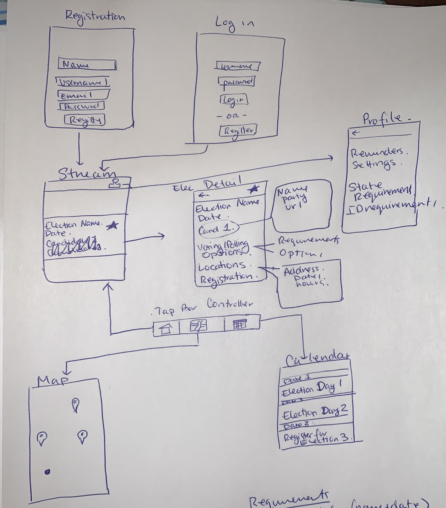

# Rock the Vote

## Alternative Titles
- VoteBoat
- iElection
- Rock and Poll

## Table of Contents
1. [Overview](#Overview)
1. [Product Spec](#Product-Spec)
1. [Wireframes](#Wireframes)
2. [Schema](#Schema)

## Overview
### Description
Rock the Vote is an application that provides election data at a local, state, and federal level based on the user's location. The goal of the application is encourage voter turnout by facilitating access to election information such as current Government representatives, running candidates, polling location, and election dates/times.

### App Evaluation
- **Category:** Productivity, Navigation, Lifestyle
- **Mobile:** 
    - Uses user location
    - Navigation feature is uniquely mobile
- **Story:** facilitates users' participation in elections at all governmental levels by providing factual information
- **Market:** young/older voters (historically low voter turnout/most likely to use social media applications for news)
- **Habit:** Users can browse through upcoming elections, set/receive reminders for polling times, and check polling locations near them
- **Scope:** depending on available information, Rock the Vote will start in only certain locations but has the potential to expand to a nationwide (USA) level.

## Product Spec

### 1. User Stories (Required and Optional)

**Required Must-have Stories**

* Sign-Up (create new account)
* Login 
* Browse upcoming elections
* Detailed election information
    * Current representatives
    * Candidates w/ links to pages
    * Polling dates/times/locations 
        * Registration
        * Early voting
        * Election day
        * Absentee ballots
* Add election to calendar
* Set/receive reminders for added elections
* Show polling location/details w/ respect to user
* View calendar
* Upload a profile picture

**Optional Nice-to-have Stories**

* Connect to Google Calendar
    * Allows user to congregate all their events & check conflicts
* Routing & Scheduling
    * Show nearest polling station
* Show detailed polling location info
* Check of elections/track progess 
    * Almost gamifying voting
* Share on social media
* Add registration deadlines + reminders
* State requirements/id requirements

### 2. Screen Archetypes

* Registration Screen
    * Sign-Up (create new account)
* Login Screen
   * Login 
* Stream
    * Browse upcoming elections
    * Add election to calendar
* Election Detail
    * Detailed election information
* Calendar
    * View calendar
* Event Detail
    * Set/receive reminders for added elections
* Map View
    * Show polling location/details w/ respect to user
* Profile
    * Upload a profile picture

### 3. Navigation

**Tab Navigation** (Tab to Screen)

* Stream (Home Feed)
* Map View (should move somewhere else)
* Calendar

**Flow Navigation** (Screen to Screen)

* Login Screen
   => Stream
* Registration
    => Stream
* Stream
    => Election Detail
    => Profile
* Election Detail
    => None
* Calendar 
    => Event Detail
* Event Detail
    => Election Detail
* Map View
    => **Optional:** Polling Detail
* Profile
    => **Optional:** Settings
    
## Wireframes
##### **Note: **Wireframe uses a different name

### Interactive Prototype
[Figma Prototype](https://www.figma.com/file/wIlXR1uDPIofdl1Rl2WvwW/iElection?node-id=0%3A1)

## Data Models

#### User
| Property  | Type |  Description | 
| --- | --- | ---|
| objectId | String | unique identifier for Parse |
| createdAt | DateTime | default field |
| updatedTime | DateTime | date when post is last updated (default field) |
| username | String |  |
| elections | Array | Pointers to elections that the user has starred | 
| calendarEvents | Array | Pointers to events that the user will be notified of |

#### Election
| Property  | Type |  Description | 
| --- | --- | --- |
| objectId | String | unique identifier for Parse |
| createdAt | DateTime | default field |
| updatedTime | DateTime | date when post is last updated (default field) |
| googleElectionId | String | unique identifier for Google civic API |
| electionDate | DateTime | date of the election |
| candidates | Array | pointers to candidate to all candidates running in the election |
| earlyPolls | Array | pointers to Poll objects for early polls |
| electionDayPolls | Array | pointers to Poll objects for election day |
| absenteeBallotLocations | Array | pointers to Poll objects to drop off absentee ballots |
| registrationLink | String | url to register for the election | 

#### Candidate

| Property  | Type |  Description | 
| --- | --- | --- |
| objectId | String | unique identifier for Parse |
| createdAt | DateTime | default field |
| updatedTime | DateTime | date when post is last updated (default field) |
| candidateId | String | unique identifier for Google civic API|
| name | String | name of candidate|
| party | String | candidate's running party |
| websiteUrl | String | link to candidate's website|
| parseElectionId | String | election id in Parse for which the candidate is running for|
| googleElectionId | String | election id (Google API) for which the candidate is running for|

#### Poll
| Property  | Type |  Description | 
| --- | --- | --- |
| objectId | String | unique identifier for Parse |
| createdAt | DateTime | default field |
| updatedTime | DateTime | date when post is last updated (default field) |
| location| String | full address for polling location |
| datesOpen | String | dates for which the polling location is available for |
| openTime | DateTime | opening time of location|
| closingTime | DateTime | closing time of location |
